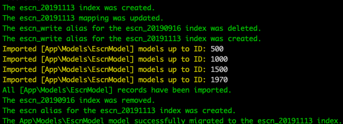

# DB 与 Es 数据迁移功能设计

1. 定义 DB 模型
2. 定义 Es index Name
3. 定义 Es index Mapping
4. 定义 DB table 与 Es index 绑定关系
5. 定义 DB table 与 Es index 数据迁移是需要做的数据转换规则
6. 为了方便切换 index 和数据迁移，数据迁移时不直接将目的 index 的名字设置为，实际使用的 index 名字，而是完成后修改别名为实际使用的 index 名字。

> 迁移脚本流程具体参考

1. 根据 escn index 创建了名为`escn_2019113`的 index
2. 根据 escn mapping 更新了`escn_2019113`的 mapping
3. 从`escn_20190916`上删除旧的 alias 实体名 escn 的指向
4. 将`escn_2019113`的 alias 改为代码中使用的 index 实体名 escn
5. 同步数据
6. 删除旧的 index `escn_20190916`
7. 完毕

