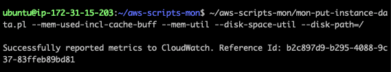
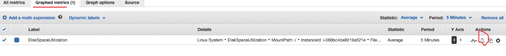

# EC2 告警设置

### 1.Health check:

    使用 aws LoadBalance 控制台设置,或者使用 aws 53 route 设置
    路径:Aws Console->LoadBalance -> monitoring-> alarm ->5xx

### 2.Cpu check:

    使用 aws Ec2 控制台可以设置
    Aws Console->Ec2-> monitoring-> alarm

    dev-solr

### 3.Free disk space & Free memory

官方文档:[https://docs.aws.amazon.com/AWSEC2/latest/UserGuide/mon-scripts.html](https://docs.aws.amazon.com/AWSEC2/latest/UserGuide/mon-scripts.html)

    常用应用场景: zk,solr

过程：

1. 安装 perl

   > sudo apt-get update

   缺少环境变量,解决方法

   > vi ~/.bashrc  
   > export LC_ALL=C  
   > source ~/.bashrc

   > sudo apt-get install unzip

   （老服务器可能出现问题，解决方法看常见问题 1，或者 sudo apt-get -f install）

   > sudo apt-get install libwww-perl libdatetime-perl

2. 下载 cloudwatch 包

   > curl https://aws-cloudwatch.s3.amazonaws.com/downloads/CloudWatchMonitoringScripts-1.2.2.zip -O

3. 安装包

   > unzip CloudWatchMonitoringScripts-1.2.2.zip && \  
   > rm CloudWatchMonitoringScripts-1.2.2.zip && \  
   > cd aws-scripts-mon

4. 测试可用性

   > ~/aws-scripts-mon/mon-put-instance-data.pl --mem-used-incl-cache-buff --mem-util --disk-space-util --disk-path=/

   返回 success 就是成功（可能出现问题 2,3,4）  
   

5. 设置 crontab
   crontab -e

   > `*/5 * * * * ~/aws-scripts-mon/mon-put-instance-data.pl --mem-used-incl-cache-buff --mem-util --disk-space-util --disk-path=/ --from-cron`

6. 查看 Cloud watch 记录
   打开 Aws console => Cloudwatch => Metrics => 查找对应 instance Id

   

7. 设置警报
   

### 常见问题:

1. 服务器 太老 需要安装 aws 的一些包

   > sudo apt-get install linux-aws-headers-4.4.0-1094

2. Ubuntu perl 问题，缺少环境变量  
   [https://blog.csdn.net/djh_xing/article/details/54944995](https://blog.csdn.net/djh_xing/article/details/54944995)

   > vi ~/.bashrc  
   > export LC_ALL=C  
   > source ~/.bashrc

3. 没有设置 iam

4. IAM 没有权限

   需要给 IAM 加以下权限

   > cloudwatch:PutMetricData  
   > cloudwatch:GetMetricStatistics  
   > cloudwatch:ListMetrics  
   > ec2:DescribeTags
