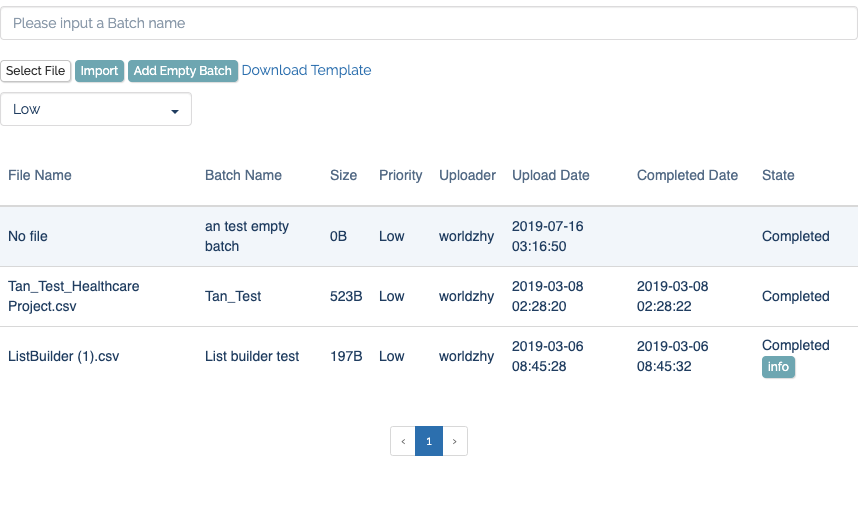
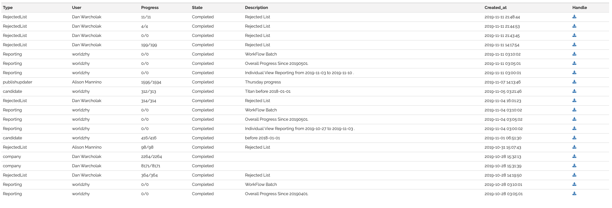

# Csv 上传下载管理模块

## 上传

### 功能点

- 上传大小限制
  前后端都要有

- 文件类型检查  
  前后端都要有，防止恶意程序注入

- 示例文档
  提供上传的 csv 文档的模板供用户下载和参考

- type 设置
  对不用类型 csv 进行隔离，安装 csv type 指派不同验证队列和使用队列

- 文档物理存储
  管理好上传的 csv 在服务器中的物理存储位置，方便进行事后验证，提供给用户进行再次下载或者其他操作，负载均衡情况下，考虑共享盘 EFS 等情况

- 异步队列验证数据并导入表中
  对上传文档 fields 数量和字段有效性检测，判断文档健康状态，通过检测后导入实际要使用数据表中(多任务，多监听进程，守护进程自动重启，防止单一任务卡壳)

* 表结构参考
  > CREATE TABLE `csv_upload` (  
  >  `id` int(11) NOT NULL AUTO_INCREMENT,  
  >  `csv_original_name` varchar(255) DEFAULT NULL,  
  >  `csv_name` varchar(255) DEFAULT NULL,  
  >  `file_path` varchar(255) DEFAULT NULL,  
  >  `check_type` varchar(255) DEFAULT NULL,  
  >  `check_status` varchar(255) DEFAULT NULL,  
  >  `check_report` text,  
  >  `uploader_id` int(11) DEFAULT NULL,  
  >  `upload_date` datetime DEFAULT NULL,  
  >  `completed_date` datetime DEFAULT NULL,  
  >  `insert_report` text,  
  >  `csv_size` varchar(32) DEFAULT NULL,  
  >  PRIMARY KEY (`id`),  
  >  KEY `csv_type` (`check_type`)  
  > ) ENGINE=InnoDB DEFAULT CHARSET=utf8

- UI 参考
  

## 下载

### 功能点

- 异步生成
  后台队列异步生成 csv 文档(多任务，多监听进程，守护进程自动重启，防止单一任务卡壳)

- 文档安全
  文档路径不可直接暴露在 web 服务器 public 下，文档的下载必须走 api 接口，不能交友 web 服务器直接做静态文件传输

- 文档物理存储
  考虑是否有负载均衡情况，要使用共享盘 EFS，让文件能跨服务器

- 表结构参考

  > CREATE TABLE `csv_list` (  
  >  `id` int(11) NOT NULL AUTO_INCREMENT,  
  >  `fileName` varchar(255) DEFAULT NULL,  
  >  `type` varchar(255) DEFAULT '',  
  >  `description` text,  
  >  `current_count` int(11) DEFAULT NULL,  
  >  `count` int(11) DEFAULT NULL,  
  >  `userid` int(11) DEFAULT NULL,  
  >  `path` varchar(255) DEFAULT NULL,  
  >  `state` varchar(255) DEFAULT NULL,  
  >  `created_at` datetime DEFAULT NULL,  
  >  `updated_at` datetime DEFAULT NULL,  
  >  PRIMARY KEY (`id`)  
  > ) ENGINE=InnoDB DEFAULT CHARSET=utf8

- UI 参考
  
